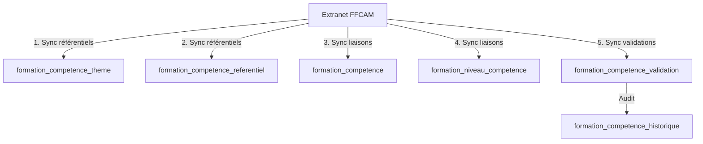

# Schéma Futur - Module Compétences FFCAM

> ⚠️ **Note importante** : Ce schéma est prévu pour une implémentation future lorsque le scraper FFCAM supportera la récupération des compétences. Les tables décrites ici ne sont pas créées actuellement.

## Contexte

Le système de gestion des compétences permettra de :
- Suivre les compétences acquises par les adhérents
- Lier les formations aux compétences qu'elles délivrent
- Définir les compétences requises pour atteindre un niveau de pratique
- Générer des rapports sur les compétences du club

## Tables à créer

### 1. `formation_competence_theme`
Classification thématique des compétences.

```sql
CREATE TABLE formation_competence_theme (
    id INT AUTO_INCREMENT NOT NULL,
    code_theme VARCHAR(10) NOT NULL,
    nom VARCHAR(255) NOT NULL,
    UNIQUE KEY UNIQ_FORM_THEME_CODE (code_theme),
    PRIMARY KEY(id)
) DEFAULT CHARACTER SET utf8mb4 COLLATE `utf8mb4_unicode_ci` ENGINE = InnoDB;
```

**Données exemple :**
- SEC : Sécurité
- ORI : Orientation
- TECH : Technique
- ENCA : Encadrement
- MED : Médical

### 2. `formation_competence_referentiel`
Référentiel des ~200 compétences officielles FFCAM.

```sql
CREATE TABLE formation_competence_referentiel (
    id INT AUTO_INCREMENT NOT NULL,
    code_competence VARCHAR(15) NOT NULL,
    titre_competence VARCHAR(255) DEFAULT NULL,
    intitule VARCHAR(255) NOT NULL,
    niveau VARCHAR(100) NOT NULL,
    theme_id INT DEFAULT NULL,
    description TEXT DEFAULT NULL,
    prerequis TEXT DEFAULT NULL,
    UNIQUE KEY UNIQ_FORM_COMP_CODE (code_competence),
    INDEX IDX_FORM_COMP_CODE (code_competence),
    INDEX IDX_FORM_COMP_THEME (theme_id),
    INDEX IDX_FORM_COMP_NIVEAU (niveau),
    PRIMARY KEY(id),
    CONSTRAINT FK_FORM_COMP_REF_THEME 
        FOREIGN KEY (theme_id) REFERENCES formation_competence_theme (id) 
        ON DELETE SET NULL
) DEFAULT CHARACTER SET utf8mb4 COLLATE `utf8mb4_unicode_ci` ENGINE = InnoDB;
```

### 3. `formation_competence_validation`
Compétences validées pour chaque adhérent.

```sql
CREATE TABLE formation_competence_validation (
    id INT AUTO_INCREMENT NOT NULL,
    user_id BIGINT NOT NULL,
    code_competence VARCHAR(15) NOT NULL,
    date_validation DATETIME DEFAULT NULL,
    source_formation VARCHAR(50) DEFAULT NULL,
    validateur VARCHAR(255) DEFAULT NULL,
    date_expiration DATETIME DEFAULT NULL,
    commentaire TEXT DEFAULT NULL,
    created_at DATETIME NOT NULL,
    updated_at DATETIME NOT NULL,
    deleted_at DATETIME DEFAULT NULL, -- Soft delete
    INDEX IDX_FORM_COMP_VAL_USER (user_id),
    INDEX IDX_FORM_COMP_VAL_CODE (code_competence),
    INDEX IDX_FORM_COMP_VAL_DATE (date_validation),
    INDEX IDX_FORM_COMP_VAL_SOURCE (source_formation),
    INDEX IDX_FORM_COMP_VAL_EXPIRATION (date_expiration),
    UNIQUE KEY UNIQ_FORM_USER_COMP (user_id, code_competence, deleted_at),
    PRIMARY KEY(id),
    CONSTRAINT FK_FORM_COMP_VAL_USER 
        FOREIGN KEY (user_id) REFERENCES caf_user (id_user) 
        ON DELETE CASCADE,
    CONSTRAINT FK_FORM_COMP_VAL_REF 
        FOREIGN KEY (code_competence) REFERENCES formation_competence_referentiel (code_competence) 
        ON DELETE RESTRICT
) DEFAULT CHARACTER SET utf8mb4 COLLATE `utf8mb4_unicode_ci` ENGINE = InnoDB;
```

### 4. `formation_competence`
Liaison entre formations et compétences délivrées.

```sql
CREATE TABLE formation_competence (
    id INT AUTO_INCREMENT NOT NULL,
    code_formation VARCHAR(50) NOT NULL,
    code_competence VARCHAR(15) NOT NULL,
    obligatoire TINYINT(1) DEFAULT 1,
    ordre INT DEFAULT 0,
    INDEX IDX_FORM_COMP_FORMATION (code_formation),
    INDEX IDX_FORM_COMP_COMPETENCE (code_competence),
    UNIQUE KEY UNIQ_FORM_FORMATION_COMP (code_formation, code_competence),
    PRIMARY KEY(id),
    CONSTRAINT FK_FORM_COMP_FORMATION_REF 
        FOREIGN KEY (code_formation) REFERENCES formation_referentiel (code_formation) 
        ON DELETE CASCADE,
    CONSTRAINT FK_FORM_COMP_COMPETENCE_REF 
        FOREIGN KEY (code_competence) REFERENCES formation_competence_referentiel (code_competence) 
        ON DELETE CASCADE
) DEFAULT CHARACTER SET utf8mb4 COLLATE `utf8mb4_unicode_ci` ENGINE = InnoDB;
```

### 5. `formation_niveau_competence`
Compétences requises pour chaque niveau de pratique.

```sql
CREATE TABLE formation_niveau_competence (
    id INT AUTO_INCREMENT NOT NULL,
    cursus_niveau_id INT NOT NULL,
    code_competence VARCHAR(15) NOT NULL,
    obligatoire TINYINT(1) DEFAULT 1,
    ordre INT DEFAULT 0,
    INDEX IDX_FORM_NIV_COMP_CURSUS (cursus_niveau_id),
    INDEX IDX_FORM_NIV_COMP_CODE (code_competence),
    UNIQUE KEY UNIQ_FORM_NIV_COMP (cursus_niveau_id, code_competence),
    PRIMARY KEY(id),
    CONSTRAINT FK_FORM_NIV_COMP_CURSUS 
        FOREIGN KEY (cursus_niveau_id) REFERENCES formation_niveau_referentiel (id) 
        ON DELETE CASCADE,
    CONSTRAINT FK_FORM_NIV_COMP_REF 
        FOREIGN KEY (code_competence) REFERENCES formation_competence_referentiel (code_competence) 
        ON DELETE CASCADE
) DEFAULT CHARACTER SET utf8mb4 COLLATE `utf8mb4_unicode_ci` ENGINE = InnoDB;
```

### 6. `formation_competence_historique` (Optionnel)
Table d'audit pour tracer l'historique des modifications.

```sql
CREATE TABLE formation_competence_historique (
    id INT AUTO_INCREMENT NOT NULL,
    user_id BIGINT NOT NULL,
    code_competence VARCHAR(15) NOT NULL,
    action ENUM('ajout', 'modification', 'suppression', 'expiration') NOT NULL,
    date_action DATETIME NOT NULL,
    donnees_avant JSON DEFAULT NULL,
    donnees_apres JSON DEFAULT NULL,
    effectue_par BIGINT DEFAULT NULL,
    commentaire TEXT DEFAULT NULL,
    INDEX IDX_HIST_USER (user_id),
    INDEX IDX_HIST_COMP (code_competence),
    INDEX IDX_HIST_DATE (date_action),
    INDEX IDX_HIST_ACTION (action),
    PRIMARY KEY(id)
) DEFAULT CHARACTER SET utf8mb4 COLLATE `utf8mb4_unicode_ci` ENGINE = InnoDB;
```

## Modifications à apporter aux tables existantes

### Table `formation_niveau_validation`
Ajouter le champ pour lier aux compétences :

```sql
ALTER TABLE formation_niveau_validation 
ADD COLUMN code_competence VARCHAR(15) DEFAULT NULL,
ADD INDEX IDX_FORM_NIV_VAL_CODE_COMP (code_competence);
```

## Flux de synchronisation prévu



## Cas d'usage futurs

### 1. Validation automatique de compétences
Lorsqu'une formation est validée, automatiquement valider les compétences associées :

```sql
-- Trigger ou logique applicative
INSERT INTO formation_competence_validation (user_id, code_competence, date_validation, source_formation)
SELECT 
    fv.user_id,
    fc.code_competence,
    fv.date_validation,
    fv.code_formation
FROM formation_validation fv
JOIN formation_competence fc ON fv.code_formation = fc.code_formation
WHERE fv.id = NEW_FORMATION_ID AND fv.valide = 1;
```

### 2. Vérification des prérequis
Avant inscription à une formation, vérifier les compétences prérequises :

```sql
-- Vérifier qu'un utilisateur a toutes les compétences requises
SELECT 
    fcr.code_competence,
    fcr.intitule,
    CASE WHEN fcv.id IS NOT NULL THEN 'Acquise' ELSE 'Manquante' END as statut
FROM formation_competence_referentiel fcr
LEFT JOIN formation_competence_validation fcv 
    ON fcr.code_competence = fcv.code_competence 
    AND fcv.user_id = :user_id
    AND fcv.deleted_at IS NULL
WHERE fcr.code_competence IN (
    -- Liste des prérequis de la formation
    SELECT prerequis_competence FROM formation_prerequis WHERE code_formation = :code_formation
);
```

### 3. Rapport de compétences du club
Statistiques sur les compétences du club :

```sql
SELECT 
    fct.nom as theme,
    fcr.intitule,
    COUNT(DISTINCT fcv.user_id) as nb_adherents,
    MIN(fcv.date_validation) as premiere_validation,
    MAX(fcv.date_validation) as derniere_validation
FROM formation_competence_validation fcv
JOIN formation_competence_referentiel fcr ON fcv.code_competence = fcr.code_competence
LEFT JOIN formation_competence_theme fct ON fcr.theme_id = fct.id
WHERE fcv.deleted_at IS NULL
GROUP BY fcr.code_competence
ORDER BY nb_adherents DESC;
```

## Points d'attention pour l'implémentation

1. **Gestion des expirations** : Certaines compétences ont une durée de validité (ex: premiers secours)
2. **Soft delete** : Permettre de conserver l'historique même après suppression
3. **Validation en cascade** : Une formation peut automatiquement valider plusieurs compétences
4. **Compétences obligatoires vs optionnelles** : Une formation peut avoir des compétences optionnelles
5. **Ordre d'acquisition** : Certaines compétences doivent être acquises dans un ordre précis
6. **Audit trail** : Traçabilité complète des modifications pour des raisons légales/assurance

## Migration depuis le schéma actuel

Lorsque le module compétences sera implémenté :

1. Créer les nouvelles tables via une migration Doctrine
2. Ajouter le champ `code_competence` à `formation_niveau_validation`
3. Importer les référentiels depuis l'extranet FFCAM
4. Migrer les données historiques si disponibles
5. Activer la synchronisation automatique

## Estimation de volumétrie

- `formation_competence_theme` : ~10 lignes
- `formation_competence_referentiel` : ~200 lignes
- `formation_competence` : ~500 lignes (liaisons)
- `formation_niveau_competence` : ~300 lignes
- `formation_competence_validation` : ~5000 lignes/an (selon activité du club)

## Contact

Pour toute question sur ce schéma futur, contacter l'équipe de développement.